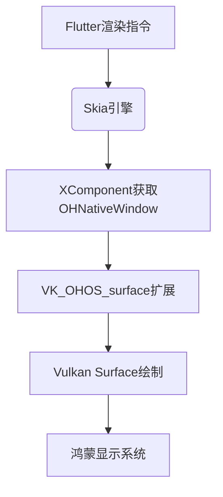

## 【HarmonyOS 5】鸿蒙跨平台开发方案详解（二）
##鸿蒙开发能力 ##HarmonyOS SDK应用服务##鸿蒙金融类应用 （金融理财#

## 一、Flutter鸿蒙适配
作为最早实现鸿蒙适配的跨平台框架，Flutter在社区推动下已形成较完整的技术方案。当前鸿蒙版Flutter已发布3.22.0-ohos版本，该版本基于Flutter 3.22.0核心。

### 1、系统能力如何对接？
通过修改嵌入层实现鸿蒙特有系统服务集成，将窗口管理、输入事件、还有鸿蒙的各种Kit的能力，通过平台通道进行集成实现。
**(1) 窗口管理：**
适配鸿蒙的窗口生命周期管理机制
**(2)  输入事件：**
重构触摸事件处理流程以匹配鸿蒙输入系统

**平台通道：**
FlutterMethodChannel类似于H5和原生之间的JSBridge。目前最新版本优化MethodChannel实现，提升与鸿蒙API的通信效率。

**Flutter 端的平台通道代码**
```typescript
import 'package:flutter/services.dart';

class HarmonyKit {
  static const MethodChannel _channel =
      MethodChannel('com.example/harmony_kit');

  // 示例：调用鸿蒙的Toast
  static Future<String?> showToast(String message) async {
    try {
      return await _channel.invokeMethod('showToast', {'message': message});
    } on PlatformException catch (e) {
      return '错误: ${e.message}';
    }
  }

}
```
**HarmonyOS 端的平台通道代码**
```typescript
// index.ets
import common from '@ohos.app.ability.common';
import promptAction from '@ohos.promptAction';
import mediaLibrary from '@ohos.multimedia.mediaLibrary';
import { BusinessError } from '@ohos.base';

@Entry
@Component
struct Index {
  private context = getContext(this) as common.UIAbilityContext;
  private flutterChannel: any = null;

  aboutToAppear() {
    this.initFlutterChannel();
  }

  // 初始化Flutter通信通道
  initFlutterChannel() {
    // 创建与Flutter通信的通道
    this.flutterChannel = new FlutterMethodChannel(
      this.context, 
      'com.example/harmony_kit', 
      StandardMethodCodec.INSTANCE
    );

    // 设置方法调用处理器
    this.flutterChannel.setMethodCallHandler((call: MethodCall, result: MethodResult) => {
      switch (call.method) {
        case 'showToast':
          this.showHarmonyToast(call.arguments.message);
          result.success('Toast已显示');
          break;
        default:
          result.notImplemented();
      }
    });
  }

  // 显示鸿蒙Toast
  async showHarmonyToast(message: string) {
    try {
      await promptAction.showToast({
        message: message,
        duration: 3000
      });
    } catch (error) {
      console.error(`显示Toast失败: ${(error as BusinessError).message}`);
    }
  }

  build() {
    Column() {
      // 鸿蒙界面组件
      Text('Flutter与鸿蒙通信示例')
        .fontSize(20)
        .fontWeight(FontWeight.Bold)
        .margin({ top: 50, bottom: 30 })
    }
    .width('100%')
  }
}
```

### 2、渲染引擎适配
**(1) 实现双渲染引擎支持：**
 **Skia渲染**：
 通过XComponent获取OHNativeWindow实例，转换为Vulkan Surface实现绘制
 利用鸿蒙原生窗口系统xComponent.getOHNativeWindow()，减少图形数据传输损耗。借助 Vulkan 的多线程并行能力，提升复杂 UI 场景的渲染效率。
 
```typescript

		Flutter UI → Skia → OHNativeWindow → Vulkan Surface → 硬件加速渲染
```


 
 **Impeller渲染**：
 利用鸿蒙ArkGraphics的Vulkan后端支持，优化图形渲染性能。这是Flutter 正在开发的新一代渲染引擎，目标是替代 Skia。
 

```typescript

	Flutter UI → Impeller → ArkGraphics(Vulkan) → 硬件加速渲染
```

 
 **渲染流程：**
 Flutter引擎编译为libflutter.so，打包进flutter.har后通过鸿蒙Clang/LLVM工具链生成可执行文件。

**两种方案对比**
| 特性               | Skia + OHNativeWindow                  | Impeller + ArkGraphics               |
|--------------------|----------------------------------------|---------------------------------------|
| **渲染引擎**       | 成熟的Skia                             | 新一代Impeller（仍在开发中）          |
| **集成方式**       | 通过OHNativeWindow间接访问Vulkan       | 直接调用ArkGraphics的Vulkan后端       |
| **性能**           | 良好，依赖Skia的优化                   | 更高，针对鸿蒙设备深度优化            |
| **兼容性**         | 支持更多鸿蒙版本                       | 依赖ArkGraphics版本，可能仅限新版本   |
| **开发难度**       | 中等（需处理窗口转换）                 | 较高（需适配新引擎）                  |

 

**(2) 核心概念：**
**Skia：**
Flutter 默认的 2D 渲染引擎，负责将 UI 绘制到屏幕上。

**XComponent：**
鸿蒙系统提供的跨设备组件，用于获取底层图形资源。

**OHNativeWindow：**
鸿蒙系统的原生窗口对象，类似 Android 的ANativeWindow。

**Vulkan：**
新一代跨平台图形 API，性能优于 OpenGL ES。Vulkan 是一种低开销、跨平台的图形与计算 API，旨在为高性能应用（如游戏、图形渲染引擎、科学计算等）提供更直接的硬件访问能力。它由 Khronos 集团（OpenGL 的开发者）开发，作为 OpenGL 的继任者，专注于提高多核 CPU 和现代 GPU 的利用率，减少驱动层开销。

### 3、混合开发支持
Flutter与ArkTS原生组件的混排方案：
```markdown
通过XComponent创建渲染表面
使用ArkUI C API将原生组件树附加到OH_NativeXComponent
Flutter将其作为PlatformView管理，实现混合布局
```

## 二、Flutter适配鸿蒙的技术底层实现原理
其实ArkUI底层实现中可见Flutter技术影子，源码层面存在兼容性基础。两边整个写法也很类似，这也是我当初转向OpenHarmony的eTS很快的原因之一。

### 1、 图形系统深度集成
Skia引擎与鸿蒙图形系统的协同机制：


### 2. 跨平台架构优势
Flutter的自绘引擎特性在鸿蒙场景下的优势：
1、无需依赖平台原生UI组件，适配成本低于React Native
2、 渲染逻辑统一，避免多平台UI差异问题
3、 与鸿蒙的分布式能力结合，可实现跨设备UI一致性渲染

## 三、Flutter适配鸿蒙方案演进路径

虽然Flutter官方声明"暂无计划原生支持鸿蒙"，但社区是有专门的团队在支撑鸿蒙适配的相关代码改造。：
1、 Open Mobile Hub项目计划2026年启动Flutter鸿蒙官方支持
2、鸿蒙社区Flutter适配团队与Google Flutter团队保持技术沟通
3、 华为内部已将Flutter作为跨平台方案之一进行评估，不过未来肯定是主推ArkUI-X。只是现在多线推动，资源紧张，肯定力保的是原生主线。等主线稳定，支线资源倾斜后，自然会更快。

### 1、企业什么情况下会倾向于Flutter？
(1) 在Android和IOS端，已构建Flutter技术栈的企业，倾向于扩展鸿蒙平台，因为Flutter适配成本降低。
(2)  对UI一致性要求高的应用，如金融类、工具类产品。像银行，证券很多都是Flutter框架实现的App。
(3) 需要跨设备部署的应用，Flutter与鸿蒙分布式能力结合可实现更好体验

### 2、Flutter鸿蒙方案的SWOT分析
| 维度        | 优势（Strengths）                | 劣势（Weaknesses）              |
|-------------|----------------------------------|---------------------------------|
| 技术架构    | 自绘引擎适配成本低，渲染性能高   | 官方支持缺失，依赖社区维护      |
| 开发效率    | 热重载机制完善，Dart语言易上手   | 鸿蒙特有能力集成需要定制开发    |
| 性能表现    | 启动速度快，交互响应接近原生     | 内存占用高于原生应用            |
| 生态现状    | 社区活跃，插件生态丰富           | 鸿蒙专用插件不足                |

| 维度        | 机会（Opportunities）          | 威胁（Threats）                |
|-------------|--------------------------------|--------------------------------|
| 生态发展    | 鸿蒙装机量增长带来应用需求     | 其他跨平台方案的竞争           |
| 技术融合    | 与鸿蒙分布式能力深度结合的可能 | 华为原生框架ArkUI-X的替代压力  |
| 企业需求    | 已有Flutter团队的迁移需求       | 维护成本高于官方推荐方案        |

下一篇文章将展开八大跨平台方案的多维度对比，从开发效率、性能表现、生态成熟度、维护成本四个关键维度建立评估体系，最后再对比原生开发，我还是倾向于原生开发哈哈哈。


