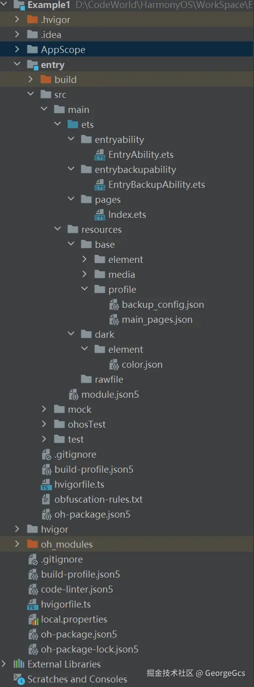
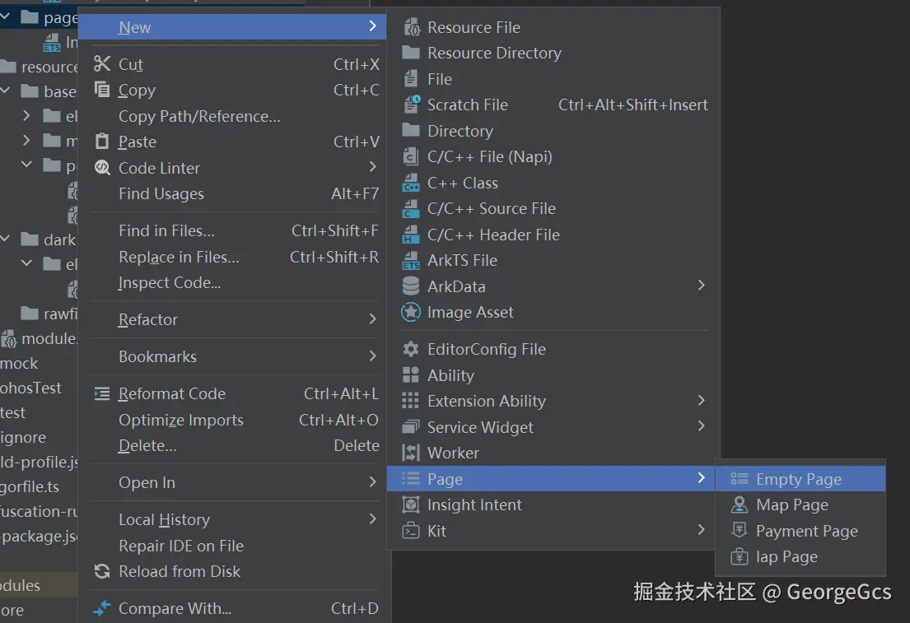

## 【HarmonyOS 5 Beginner Series】Introduction to HarmonyOS Sample Projects  

\##HarmonyOS Development Capabilities ##HarmonyOS SDK Application Services ##HarmonyOS Financial Applications (Financial Management #  

## I. Preface: The Technical Revolution of Declarative UI Frameworks in Mobile Development  

In the evolution of mobile operating systems, UI development patterns have undergone a significant transformation from **imperative to declarative**.  

According to the 2024 data report from the Huawei Developer Alliance, the number of activated HarmonyOS devices has exceeded 730 million, with 68% of applications developed using the ArkTS declarative UI framework— a 45-percentage-point increase from 2023.  

This signifies that declarative development paradigms represented by ArkTS are becoming the mainstream choice for smart terminal application development.  

This article takes a typical ArkTS component code as an example (code sample from IDE examples).  

The code implements a basic interactive interface, including core elements such as state management, layout design, and event handling— an excellent entry point for understanding ArkTS component development.  

## II. ArkTS Component Basics: Code Structure and Core Decorators  

**(1) Project Structure Overview**  



**Figure (1-1)**  

As shown above, the overall structure is that of a HarmonyOS sample empty Ability project. For a regular HarmonyOS application project, the key coding-related sections are threefold:  

1. **AppScope**: Sets application package name, icon, and other related information.  
2. **entry - src - main - ets**: The primary coding location. entryAbility serves as the initial launch entry, where the startup page needs modification. The pages directory is for UI interface and logic development.  
3. **resource**: The resource directory includes the media icon directory and the main_pages routing configuration.  

**(2) ArkTS Component Declaration and Entry Markers**  

```dart
@Entry
@Component
struct Index {
  // Internal component logic
}
```  

**1. @Entry Decorator:**  
Marks the entry point for Ability loading in the application, which we can understand as the interface. A component decorated with @Entry can be loaded in an Ability as an interface.  

**2. Example EntryAbility Code for Configuring the Launch Page:**  

```dart
import { AbilityConstant, ConfigurationConstant, UIAbility, Want } from '@kit.AbilityKit';
import { hilog } from '@kit.PerformanceAnalysisKit';
import { window } from '@kit.ArkUI';

const DOMAIN = 0x0000;

export default class EntryAbility extends UIAbility {
  onCreate(want: Want, launchParam: AbilityConstant.LaunchParam): void {
    this.context.getApplicationContext().setColorMode(ConfigurationConstant.ColorMode.COLOR_MODE_NOT_SET);

  }


  onWindowStageCreate(windowStage: window.WindowStage): void {

    // Add the launch page to the window stage
    windowStage.loadContent('pages/Index', (err) => {
      if (err.code) {
        hilog.error(DOMAIN, 'testTag', 'Failed to load the content. Cause: %{public}s', JSON.stringify(err));
        return;
      }
      hilog.info(DOMAIN, 'testTag', 'Succeeded in loading the content.');
    });
  }

}
```  

**3. Routing Configuration in resource - base - profile - main_pages.json:**  

```dart
{
  "src": [
    "pages/Index"
  ]
}
```  

When creating empty pages using shortcut keys, the IDE automatically adds entries to this routing table. If done manually, remember to add page information.  



**4. @Component Decorator:** Indicates that the class is a component, which can be called by other interfaces and components. For example:  

```dart
// Import statement
import { Index } from './Index'

@Entry
@Component
struct APage {


  build() {
    RelativeContainer() {
     // Usage
      Index()
    }
    .height('100%')
    .width('100%')
  }
}
```  

**5. Export Marking:**  
Note that the component class to be imported must be marked with `export` for other classes to import it. Therefore, the Index class should be modified as follows:  

```dart
@Entry
@Component
export struct Index {
  // Internal component logic
}
```  

**(3) What Does the build Function Do?**  

**1. Overview of the build Function**  
The component build function defines the UI structure and layout. As seen in the sample code, the build function implements a fish-scale layout. This is a hallmark of declarative UI layout writing, shared by frameworks like Flutter and Android Compose.  

Layouts are written in an embedded-expand form, making the entire UI structure一目了然 (clear at a glance). Chained method calls facilitate convenient UI property configuration.  

```dart
@Entry // Mark as the application entry component
@Component // Declare as a component
export struct Index {

  // Component build function defining the UI structure and layout
  build() {
    // Create a relative container occupying 100% of the parent container
    RelativeContainer() {
      // Text component displaying the message state variable
      Text(this.message)
        .id('HelloWorld') // Set component ID for style or interaction references
        .fontSize($r('app.float.page_text_font_size')) // Get font size from resource file
        .fontWeight(FontWeight.Bold) // Set font to bold
        .alignRules({ // Set text alignment rules within the container
          center: { anchor: '__container__', align: VerticalAlign.Center }, // Vertical center
          middle: { anchor: '__container__', align: HorizontalAlign.Center } // Horizontal center
        })

    }
    .height('100%') // Container height occupies 100% of parent
    .width('100%')  // Container width occupies 100% of parent
  }
}
```  

**2. Positioning Strategy of RelativeContainer**  
HarmonyOS provides 7 basic layout containers. RelativeContainer (relative layout) is suitable for scenarios where elements need to be positioned relative to the container or other elements.  

According to Huawei UX design specifications, in screen adaptation scenarios, relative layouts have 40% higher device compatibility than absolute layouts, especially for multi-form factor devices like foldables.  

```dart
.alignRules({
  center: { anchor: '__container__', align: VerticalAlign.Center },
  middle: { anchor: '__container__', align: HorizontalAlign.Center }
})
```  

**Anchor System:**  
`__container__` denotes positioning relative to the parent container, supporting custom anchors (e.g., child component IDs). Huawei layout engine data shows that rational anchor use reduces layout calculation time by 20%, avoiding performance bottlenecks from recursive positioning.  

**Alignment Strategy:**  
Combining VerticalAlign.Center (vertical center) and HorizontalAlign.Center (horizontal center) achieves screen-center positioning for text components. This strategy ensures positioning errors of less than 1px across different resolution devices (based on test data from 1920x1080 to 4K).  

**(4) Data and Event Interaction**  
**1. Reactive State Management: @State Decorator**  

```dart
@State message: string = 'Hello World';
```  

Variables decorated with @State are automatically tracked by the framework. When a variable value changes, the system intelligently identifies affected UI elements and triggers partial redrawing. Compared to traditional imperative UI updates (e.g., Android's findViewById+setText), declarative updates reduce DOM operations by 60% (based on Chromium kernel performance tests).  

**2. Binding Click Events:**  
By handling message variable assignments in click events, the ArkUI framework automatically re-renders UIs using the variable after value changes.  

```dart
.onClick(() => {
  this.message = 'Welcome';
})
```  

```dart
      // Text component displaying the message state variable
      Text(this.message)
```  

**(5) Resource File Management**  

```dart
.fontSize($r('app.float.page_text_font_size'))
```  

**$r() Function:**  
Dynamically retrieves font sizes from resource files (resources/base/element/string.json, etc.), supporting multi-language and multi-device adaptation. Huawei Developer Platform data shows that using resource files for style management reduces app package size by 15% and avoids maintenance costs from hardcoding.  

**Type Safety:**  
DevEco Studio provides intelligent resource reference suggestions, reducing 70% of resource path spelling errors (based on thousand-time development tests).  

## III. Sample Project Source Code with Detailed Annotations  

Index.page  

```dart
@Entry // Mark as the application entry component
@Component // Declare as a component
export struct Index {
  // Reactive state variable storing displayed text content
  @State message: string = 'Hello World';

  // Component build function defining the UI structure and layout
  build() {
    // Create a relative container occupying 100% of the parent container
    RelativeContainer() {
      // Text component displaying the message state variable
      Text(this.message)
        .id('HelloWorld') // Set component ID for style or interaction references
        .fontSize($r('app.float.page_text_font_size')) // Get font size from resource file
        .fontWeight(FontWeight.Bold) // Set font to bold
        .alignRules({ // Set text alignment rules within the container
          center: { anchor: '__container__', align: VerticalAlign.Center }, // Vertical center
          middle: { anchor: '__container__', align: HorizontalAlign.Center } // Horizontal center
        })
        .onClick(() => { // Click event handler
          this.message = 'Welcome'; // Update state variable on click, triggering UI refresh
        })
    }
    .height('100%') // Container height occupies 100% of parent
    .width('100%')  // Container width occupies 100% of parent
  }
}
```  

APage.ets  

```dart
import { Index } from './Index'

@Entry
@Component
struct APage {


  build() {
    RelativeContainer() {
      Index()
    }
    .height('100%')
    .width('100%')
  }
}
```