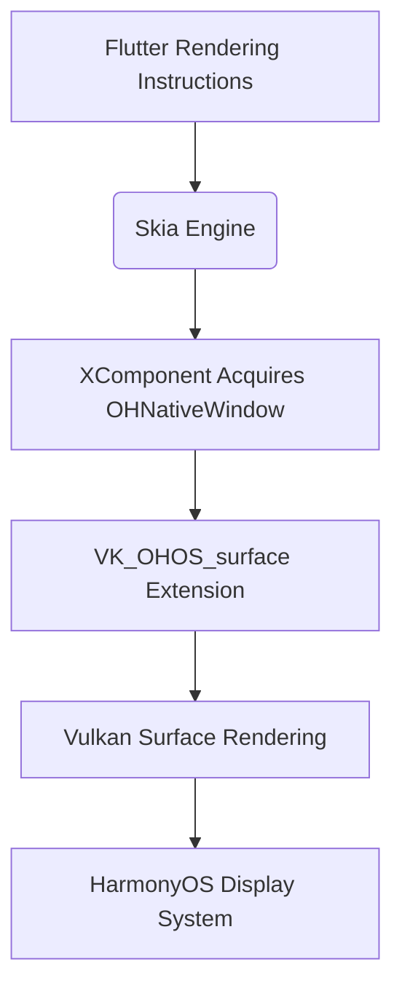

## 【HarmonyOS 5】Detailed Explanation of HarmonyOS Cross-Platform Development Solutions (Part 2)  
## HarmonyOS Development Capabilities ## HarmonyOS SDK Application Services ## HarmonyOS Financial Applications (Financial Management #  


### 一、Flutter Adaptation for HarmonyOS  
As one of the earliest cross-platform frameworks to achieve HarmonyOS adaptation, Flutter has formed a relatively complete technical solution driven by the community. The current HarmonyOS version of Flutter, 3.22.0-ohos, is based on the Flutter 3.22.0 core.  


#### 1、How to Connect System Capabilities?  
System capabilities unique to HarmonyOS are integrated by modifying the embedding layer, including window management, input events, and various HarmonyOS Kits, which are integrated through platform channels.  

**(1) Window Management:**  
Adapt to HarmonyOS's window lifecycle management mechanism.  

**(2) Input Events:**  
Refactor the touch event processing flow to match HarmonyOS's input system.  

**Platform Channel:**  
The FlutterMethodChannel is similar to the JSBridge between H5 and native systems. The latest version optimizes the MethodChannel implementation to improve communication efficiency with HarmonyOS APIs.  

**Flutter-side Platform Channel Code**  
```typescript  
import 'package:flutter/services.dart';  

class HarmonyKit {  
  static const MethodChannel _channel =  
      MethodChannel('com.example/harmony_kit');  

  // Example: Invoke HarmonyOS Toast  
  static Future<String?> showToast(String message) async {  
    try {  
      return await _channel.invokeMethod('showToast', {'message': message});  
    } on PlatformException catch (e) {  
      return 'Error: ${e.message}';  
    }  
  }  
}  
```  

**HarmonyOS-side Platform Channel Code**  
```typescript  
// index.ets  
import common from '@ohos.app.ability.common';  
import promptAction from '@ohos.promptAction';  
import mediaLibrary from '@ohos.multimedia.mediaLibrary';  
import { BusinessError } from '@ohos.base';  

@Entry  
@Component  
struct Index {  
  private context = getContext(this) as common.UIAbilityContext;  
  private flutterChannel: any = null;  

  aboutToAppear() {  
    this.initFlutterChannel();  
  }  

  // Initialize Flutter communication channel  
  initFlutterChannel() {  
    // Create a channel for communication with Flutter  
    this.flutterChannel = new FlutterMethodChannel(  
      this.context,  
      'com.example/harmony_kit',  
      StandardMethodCodec.INSTANCE  
    );  

    // Set method call handler  
    this.flutterChannel.setMethodCallHandler((call: MethodCall, result: MethodResult) => {  
      switch (call.method) {  
        case 'showToast':  
          this.showHarmonyToast(call.arguments.message);  
          result.success('Toast has been displayed');  
          break;  
        default:  
          result.notImplemented();  
      }  
    });  
  }  

  // Display HarmonyOS Toast  
  async showHarmonyToast(message: string) {  
    try {  
      await promptAction.showToast({  
        message: message,  
        duration: 3000  
      });  
    } catch (error) {  
      console.error(`Failed to display Toast: ${(error as BusinessError).message}`);  
    }  
  }  

  build() {  
    Column() {  
      // HarmonyOS UI components  
      Text('Flutter-HarmonyOS Communication Example')  
        .fontSize(20)  
        .fontWeight(FontWeight.Bold)  
        .margin({ top: 50, bottom: 30 })  
    }  
    .width('100%')  
  }  
}  
```  


#### 2、Rendering Engine Adaptation  
**(1) Support for Dual Rendering Engines:**  
**Skia Rendering:**  
Obtain the OHNativeWindow instance through XComponent and convert it to a Vulkan Surface for rendering.  
Utilize the鸿蒙原生窗口系统xComponent.getOHNativeWindow() to reduce graphic data transmission loss. Leverage Vulkan's multi-threading parallel capabilities to enhance rendering efficiency in complex UI scenarios.  

```typescript  
Flutter UI → Skia → OHNativeWindow → Vulkan Surface → Hardware-Accelerated Rendering  
```  

**Impeller Rendering:**  
Utilize the Vulkan backend support of HarmonyOS ArkGraphics to optimize graphic rendering performance. Impeller is a new-generation rendering engine under development by Flutter, aiming to replace Skia.  

```typescript  
Flutter UI → Impeller → ArkGraphics(Vulkan) → Hardware-Accelerated Rendering  
```  

**Rendering Process:**  
The Flutter engine is compiled into libflutter.so, packaged into flutter.har, and then converted into an executable file through HarmonyOS's Clang/LLVM toolchain.  

**Comparison of the Two Solutions**  
| Feature               | Skia + OHNativeWindow                  | Impeller + ArkGraphics               |  
|---------------------|--------------------------------------|--------------------------------------|  
| **Rendering Engine**  | Mature Skia                           | New-generation Impeller (still in development) |  
| **Integration Method**| Indirect access to Vulkan via OHNativeWindow | Direct call to ArkGraphics' Vulkan backend    |  
| **Performance**       | Good, relying on Skia optimizations      | Higher, deeply optimized for HarmonyOS devices |  
| **Compatibility**     | Supports more HarmonyOS versions          | Depends on ArkGraphics version, may be limited to new versions |  
| **Development Difficulty** | Medium (requires window conversion)      | Higher (requires adaptation to the new engine) |  

**(2) Core Concepts:**  
**Skia:**  
Flutter's default 2D rendering engine, responsible for drawing UI to the screen.  

**XComponent:**  
A cross-device component provided by HarmonyOS for accessing underlying graphic resources.  

**OHNativeWindow:**  
HarmonyOS's native window object, similar to Android's ANativeWindow.  

**Vulkan:**  
A new-generation cross-platform graphics API with better performance than OpenGL ES. Vulkan is a low-overhead, cross-platform graphics and computing API designed to provide more direct hardware access for high-performance applications (such as games, graphic rendering engines, scientific computing, etc.). Developed by the Khronos Group (the developer of OpenGL), as the successor to OpenGL, it focuses on improving the utilization of multi-core CPUs and modern GPUs while reducing driver-level overhead.  


#### 3、Hybrid Development Support  
Layout mixing scheme for Flutter and ArkTS native components:  
```markdown  
Create a rendering surface through XComponent  
Use ArkUI C API to attach the native component tree to OH_NativeXComponent  
Flutter manages it as a PlatformView to achieve hybrid layout  
```  


### 二、Technical Underlying Implementation Principles of Flutter Adaptation for HarmonyOS  
In fact, traces of Flutter technology can be seen in the underlying implementation of ArkUI, and there is a compatibility foundation at the source code level. The coding styles of both are also quite similar, which is one of the reasons why I quickly transitioned to OpenHarmony's eTS.  


#### 1、Deep Integration of Graphics System  
Collaboration mechanism between the Skia engine and HarmonyOS graphics system:  



#### 2、Advantages of Cross-Platform Architecture  
Advantages of Flutter's self-rendering engine in HarmonyOS scenarios:  
1. No dependency on platform-native UI components, with lower adaptation costs than React Native.  
2. Unified rendering logic avoids UI inconsistency issues across platforms.  
3. Combined with HarmonyOS's distributed capabilities, it enables consistent UI rendering across devices.  


### 三、Evolution Path of Flutter Adaptation for HarmonyOS  
Although the Flutter official team states that "there are no plans for native support for HarmonyOS," the community has a dedicated team supporting code modifications for HarmonyOS adaptation:  
1. The Open Mobile Hub project plans to launch official Flutter support for HarmonyOS in 2026.  
2. The HarmonyOS community's Flutter adaptation team maintains technical communication with Google's Flutter team.  
3. Huawei internally has evaluated Flutter as one of the cross-platform solutions, but in the future, ArkUI-X will certainly be the main focus. Currently, with multi-line promotion and tight resources, the native mainline is prioritized. Once the mainline stabilizes and resources are allocated to支线, progress will naturally accelerate.  


#### 1、When Do Enterprises Tend to Choose Flutter?  
(1) Enterprises that have built a Flutter technology stack for Android and iOS tend to expand to the HarmonyOS platform due to reduced adaptation costs.  
(2) Applications with high UI consistency requirements, such as financial and utility products. Many bank and securities apps are implemented using the Flutter framework.  
(3) Applications requiring cross-device deployment, as Flutter combined with HarmonyOS's distributed capabilities can achieve a better experience.  


#### 2、SWOT Analysis of Flutter HarmonyOS Solution  
| Dimension       | Strengths                          | Weaknesses                          |  
|---------------|----------------------------------|-----------------------------------|  
| Technical Architecture | Low adaptation cost due to self-rendering engine, high rendering performance | Lack of official support, dependent on community maintenance |  
| Development Efficiency | Perfect hot reload mechanism, easy-to-learn Dart language | Custom development required for integrating HarmonyOS-specific capabilities |  
| Performance        | Fast startup speed, interaction response close to native | Higher memory usage than native applications |  
| Ecosystem Status   | Active community, rich plugin ecosystem | Insufficient HarmonyOS-specific plugins |  

| Dimension       | Opportunities                      | Threats                          |  
|---------------|--------------------------------|---------------------------------|  
| Ecosystem Development | Growing HarmonyOS device shipments driving application demand | Competition from other cross-platform solutions |  
| Technical Integration | Possibility of deep integration with HarmonyOS's distributed capabilities | Substitution pressure from Huawei's native framework ArkUI-X |  
| Enterprise Needs    | Migration needs of existing Flutter teams | Higher maintenance costs than officially recommended solutions |  

The next article will expand on a multi-dimensional comparison of eight cross-platform solutions, establishing an evaluation system based on four key dimensions: development efficiency, performance, ecosystem maturity, and maintenance costs. Finally, comparing with native development, I still tend to prefer native development haha.